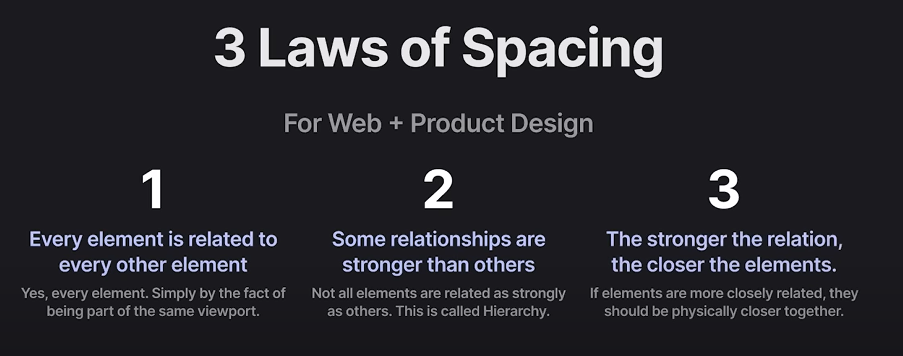

# CSS


## Animation

```css
animation-name: name
animation-duration: 0
animation-timing-function: ease
animation-delay: 0
animation-iteration-count: 1
animation-direction: normal
animation-fill-mode: none
animation-play-state: running

div{
  width: 200px;
  height: 200px;
  background: red;
  animation: animScale 2000ms ease-in-out 1000ms infinite,
  animOpacity 2000ms ease-in-out 2000ms infinite;
  /_ scale will start after 1s and opacity after 2s (1s after the scale)_/
}
```


## Relationships

Spacing Rules for Text

