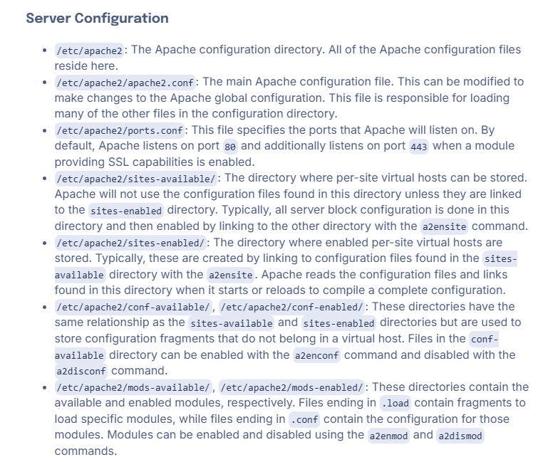

# Apache

Apache2 is a webserver

## Install

`sudo apt install apache2`
`sudo apt install apache2-doc`
`sudo apt install apache2-utils`

`sudo apt install apache2 apache2-doc apache2-utils` quick install

Create a folder for your site in /var/www or var/www/html
Create a config file for you site in /etc/apache2/sites-available/
Add DocumentRoot /var/www/NAME
Add ServerName example.com
Activate the config sudo a2ensite example.com

`sudo a2ensite your_domain.conf`
`sudo apache2ctl configtest`

```py
<VirtualHost *:80>
        ServerAdmin webmaster@localhost
        DocumentRoot /var/www/cat-app.app
        ServerName cat-app.app
        ServerAlias www.cat-app.app

        ErrorLog ${APACHE_LOG_DIR}/error.log
        CustomLog ${APACHE_LOG_DIR}/access.log combined
</VirtualHost>
```

## SSL

`sudo apt install certbot python3-certbot-apache` install certbot
`sudo certbot --apache -d cat-app.app` create certificate

## Firewall

`sudo ufw allow 'Apache Full'`

you can now follow your ip to the Apache default page

## Commands

`sudo systemctl stop apache2`
`sudo systemctl start apache2`
`sudo systemctl restart apache2`
`sudo systemctl reload apache2`
`sudo systemctl disable apache2`
`sudo systemctl enable apache2`

`sudo apache2ctl configtest` test syntax of conf file

`sudo a2ensite 000-default.conf` enable default connection
`sudo cp -r /etc/apache2 /etc/apache2.bak` backup apache
`sudo tail -f /var/log/apache2/mynewdomain_error.log` check logs

## Hosting

`sudo mkdir -p /var/www/html/mynewdomain.com` create the folders with -p if a dir doesnt exist
`sudo nano /etc/apache2/sites-available/mynewdomain.com.conf` create a config file

## Serve multiple sites

`sudo mkdir /var/www/your_domain`
`sudo chown -R $USER:$USER /var/www/your_domain`

```md
<VirtualHost _:80> 
# This defines a Virtual Host that listens on port 80 (HTTP). # The '_' means it applies to all network interfaces of the server.

    ServerName mynewdomain.com
    # The primary domain name for this virtual host. Apache uses this
    # to match incoming requests to this configuration.

    ServerAlias www.mynewdomain.com
    # Additional domain names or subdomains that should point to this
    # virtual host. For example, 'www.mynewdomain.com' will resolve here.

    DocumentRoot /var/www/html/mynewdomain.com
    # The root directory of the website's files. This is where Apache looks
    # for the files to serve for requests to this domain.

    <Directory /var/www/html/mynewdomain.com>
        # Directory-specific settings for the DocumentRoot.

        AllowOverride All
        # Enables the use of .htaccess files in this directory, allowing
        # overrides to server configuration for things like URL rewrites.

        Require all granted
        # Allows access to this directory from all clients. This is necessary
        # for the site to be publicly accessible.
    </Directory>

    ErrorLog ${APACHE_LOG_DIR}/mynewdomain_error.log
    # Defines the file where errors specific to this virtual host are logged.
    # ${APACHE_LOG_DIR} typically resolves to /var/log/apache2/.

    CustomLog ${APACHE_LOG_DIR}/mynewdomain_access.log combined
    # Defines the file for logging all access requests to this virtual host.
    # The "combined" format includes detailed information such as client IP,
    # HTTP status codes, and user agents.

</VirtualHost>
```

`sudo a2ensite mynewdomain.com.conf` enable site
`sudo systemctl reload apache2` reload
`curl -I http://mynewdomain.com` test



## Config code

1. <VirtualHost \*:80>

   This line specifies that this configuration applies to HTTP requests (port 80).
   The _ means it will listen on all network interfaces.
   If you were configuring HTTPS, you'd use <VirtualHost _:443> instead.

2. ServerName mynewdomain.com

   This specifies the primary domain name for this virtual host.
   Requests matching this domain will be routed to this configuration.

3. ServerAlias www.mynewdomain.com

   This allows the virtual host to respond to additional domain names or subdomains.
   Here, it ensures www.mynewdomain.com is treated as equivalent to mynewdomain.com.

4. DocumentRoot /var/www/html/mynewdomain.com

   This defines the directory where your website files are stored.
   Apache serves files from this location when someone accesses the domain.

5. <Directory /var/www/html/mynewdomain.com>

   This block configures permissions and behavior for the directory specified in DocumentRoot.

a. AllowOverride All

    This enables .htaccess files in the directory to override global Apache settings.
    Commonly used for custom URL rewrites, authentication, or enabling modules like mod_rewrite.

b. Require all granted

    Grants access to all users.
    For stricter configurations, you might replace it with:
        Require local (restrict access to the server itself).
        Require ip xxx.xxx.xxx.xxx (allow specific IPs).

6. ErrorLog ${APACHE_LOG_DIR}/mynewdomain_error.log

   Specifies the file where Apache logs errors for this domain.
   The ${APACHE_LOG_DIR} variable typically resolves to /var/log/apache2/.

7. CustomLog ${APACHE_LOG_DIR}/mynewdomain_access.log combined

   Specifies the file where Apache logs access requests (e.g., IPs, URLs, timestamps).
   The combined format includes detailed request information such as:
   Remote host
   Request method
   Requested URL
   HTTP status code
   User agent string (browser, bot, etc.).

Example Workflow

    Client Request: When someone visits http://mynewdomain.com, Apache:
        Checks if a virtual host matches the ServerName or ServerAlias.
        If found, serves the files from the DocumentRoot.
    Error Handling: If something goes wrong (e.g., missing files), Apache logs it to mynewdomain_error.log.
    Access Logging: Every visit is recorded in mynewdomain_access.log for analysis.

## Complex Setup

1. Optimize Apache Configuration
   a. Enable and Configure mpm_prefork or mpm_event

Apache uses different Multi-Processing Modules (MPM) to handle multiple requests. Depending on your server’s workload, choose the appropriate one.

    mpm_prefork is more suitable for older applications that need to maintain backward compatibility with threaded libraries (e.g., some PHP applications).
    mpm_event is recommended for handling high numbers of requests as it allows Apache to handle multiple connections with fewer resources.

To ensure the mpm_event module is enabled, run:

sudo a2enmod mpm_event

Then, disable the default mpm_prefork if it's enabled:

sudo a2dismod mpm_prefork

b. Adjust Apache Worker Limits

You can tweak the number of workers Apache uses to handle requests. These settings can be found in /etc/apache2/mods-available/mpm_event.conf (or the equivalent for other MPMs).

Here's an example of optimized settings for the mpm_event module:

<IfModule mpm_event_module>
    StartServers          4
    MinSpareThreads       75
    MaxSpareThreads       250
    ThreadLimit           64
    ThreadsPerChild       25
    MaxRequestWorkers     150
    MaxConnectionsPerChild   10000
</IfModule>

    StartServers: Number of servers to start initially.
    MinSpareThreads: Minimum number of idle threads.
    MaxSpareThreads: Maximum number of idle threads.
    ThreadsPerChild: Number of threads per Apache worker.
    MaxRequestWorkers: Maximum number of simultaneous requests that can be served.
    MaxConnectionsPerChild: How many requests a worker can serve before it is killed.

Adjust these values based on the available resources (CPU, RAM) on your server.
c. Enable Keep-Alive

Keep-Alive allows a single connection to handle multiple requests, reducing overhead. Ensure it's enabled and configured to use an appropriate timeout value:

KeepAlive On
MaxKeepAliveRequests 100
KeepAliveTimeout 5

2. Leverage Caching to Reduce Load
   a. Enable Mod_Cache and Mod_Expires

Apache has built-in modules like mod_cache and mod_expires that can cache content and reduce load.

For static content (images, CSS, JavaScript), you can set expiration times to tell browsers to cache the content.

In your Apache configuration or .htaccess, add the following:

<IfModule mod_expires.c>
    ExpiresActive On
    ExpiresDefault "access plus 1 year"
    ExpiresByType image/jpg "access plus 1 year"
    ExpiresByType image/jpeg "access plus 1 year"
    ExpiresByType image/gif "access plus 1 year"
    ExpiresByType image/png "access plus 1 year"
    ExpiresByType text/css "access plus 1 month"
    ExpiresByType application/javascript "access plus 1 month"
    ExpiresByType application/x-javascript "access plus 1 month"
</IfModule>

b. Use mod_deflate for Compression

Enable mod_deflate to compress responses before sending them to clients, which reduces bandwidth usage and speeds up delivery.

To enable it:

sudo a2enmod deflate

In your Apache configuration or .htaccess, add:

<IfModule mod_deflate.c>
    AddOutputFilterByType DEFLATE text/plain text/html text/xml text/css application/javascript application/json
</IfModule>

3. Use a Content Delivery Network (CDN)

A CDN (e.g., Cloudflare, AWS CloudFront, or others) caches your static content across multiple servers worldwide. It reduces the load on your server and improves website performance, especially for users geographically distant from your origin server. 4. Database Optimization

If your site relies on a database (e.g., MySQL or PostgreSQL), optimizing database queries and configuration is critical for handling high traffic.
a. Database Indexing

Ensure your database queries are optimized and that appropriate indexes are used for frequently queried fields.
b. Use Caching for Database Queries

Implement caching mechanisms like Redis or Memcached to cache database queries and reduce database load.
c. Connection Pooling

Enable database connection pooling to manage and reuse database connections efficiently, reducing overhead. 5. Monitor and Adjust Server Resources
a. Use a Monitoring Tool

To effectively handle large traffic loads, monitoring your server's performance is critical. Tools like Netdata, Nagios, Prometheus, or Zabbix can help you track metrics like CPU usage, memory, disk usage, and network traffic.
b. Auto-Scaling (For Cloud Servers)

If you're using a cloud provider (AWS, GCP, Azure), consider implementing auto-scaling to automatically adjust resources based on traffic.
c. Optimize Your Server’s Limits

Ensure that system-level limits like file descriptors and memory usage are adjusted appropriately to avoid bottlenecks.

For example, increase the maximum number of open file descriptors:

sudo ulimit -n 65536

6. Implement Load Balancing

If your website is receiving very high traffic, consider using load balancing to distribute incoming requests across multiple web server instances. You can use HAProxy or Nginx as a reverse proxy to distribute traffic evenly. 7. Improve Security and Protect Against DDoS

High traffic can also mean exposure to attacks. Implement security mechanisms to protect your web server:

    Use fail2ban to block malicious IPs trying to brute-force SSH or web applications.
    Set up rate limiting with Apache to protect against DDoS attacks (use mod_evasive or mod_security).
    Enable SSL/TLS encryption to protect sensitive data.

Example of Rate Limiting in Apache:

<IfModule mod_evasive20.c>
    DOSHashTableSize 3097
    DOSPageCount 2
    DOSSiteCount 50
    DOSPageInterval 1
    DOSSiteInterval 1
</IfModule>

8. Consider Using a Reverse Proxy

A reverse proxy like Varnish or Nginx in front of Apache can serve static content directly, reducing the load on Apache, which can then focus on dynamic content processing (e.g., PHP). 9. Keep Your Software Updated

Always ensure that Apache, PHP, MySQL, and any other software you're using is up-to-date to benefit from security patches and performance improvements.

sudo apt update && sudo apt upgrade

10. Backup and Disaster Recovery

Ensure you have a robust backup strategy for both your website files and database to quickly recover in case of a failure.
Summary:

    Optimize Apache performance by adjusting the MPM settings and enabling caching and compression.
    Use a CDN to distribute content efficiently and reduce the load on your server.
    Optimize your database by ensuring queries are efficient and caching frequently accessed data.
    Monitor your server with tools like Netdata or Nagios, and ensure that server limits are adequate.
    Consider load balancing if your traffic exceeds the capacity of a single server.
    Protect against DDoS and other attacks with fail2ban, mod_security, and rate limiting.

By following these steps, you'll significantly improve your Apache web server’s ability to handle high traffic efficiently. Let me know if you need more details on any of these steps!
