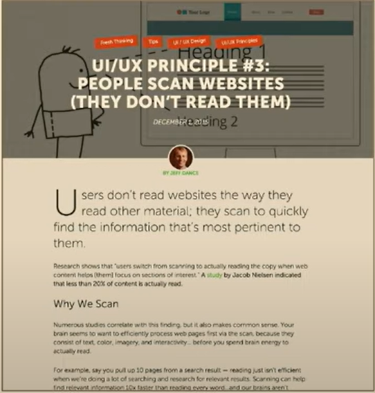

# Style

## Text

1. Length - 60 to 100 characters per line - ch units
2. Line height - 1.4-1.5
3. Padding - min 14px 

## Words

1. Contrast - No yellow text on white bg
2. Text size - 16px min
3. Make your text scannable quickly
4. Bulleted lists
5. Smaller letter spacing on headers
6. 2 - 3 type faces
7. Limit colours 3 - 5 max

## Images

1. There are very few universal icons - limit icons
2. Best places for icons is with other data like text
3. Avoid conflicting meanings in icons
4. Should not need to get item infomation with a label on hover
5. Dont add images to spice things up (Banner blindness)
6. Images must e informative and relative

## Examples

### Bad vs Good

